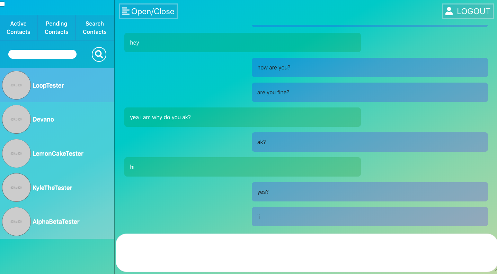
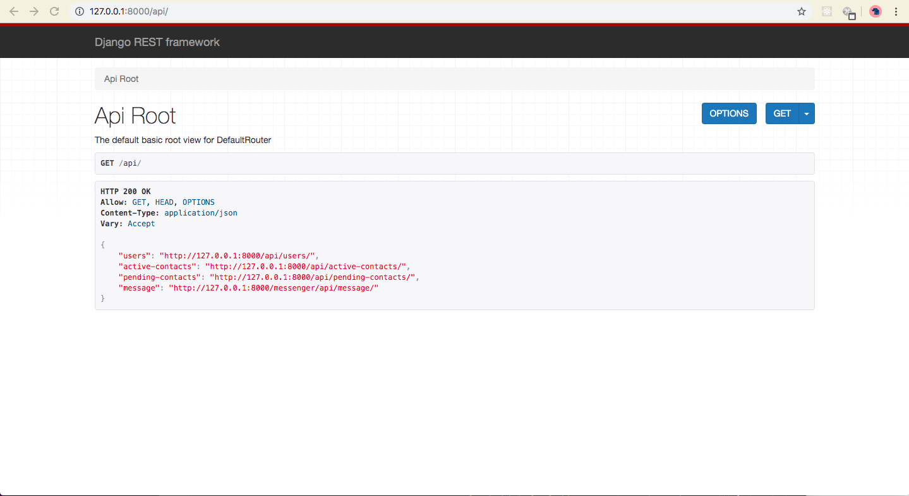

# Messenger-Appllication
Open Source(Work In Progress) 65% Complete. Messenger Application Written Using Django Rest , Web Sockets, ReactJs, Mobx, SQL. The End Design Is That This Becomes A Self Contained Django Module That Could Be Integrated Into Any Django Application With A Easily Customisable React Based Front End 

